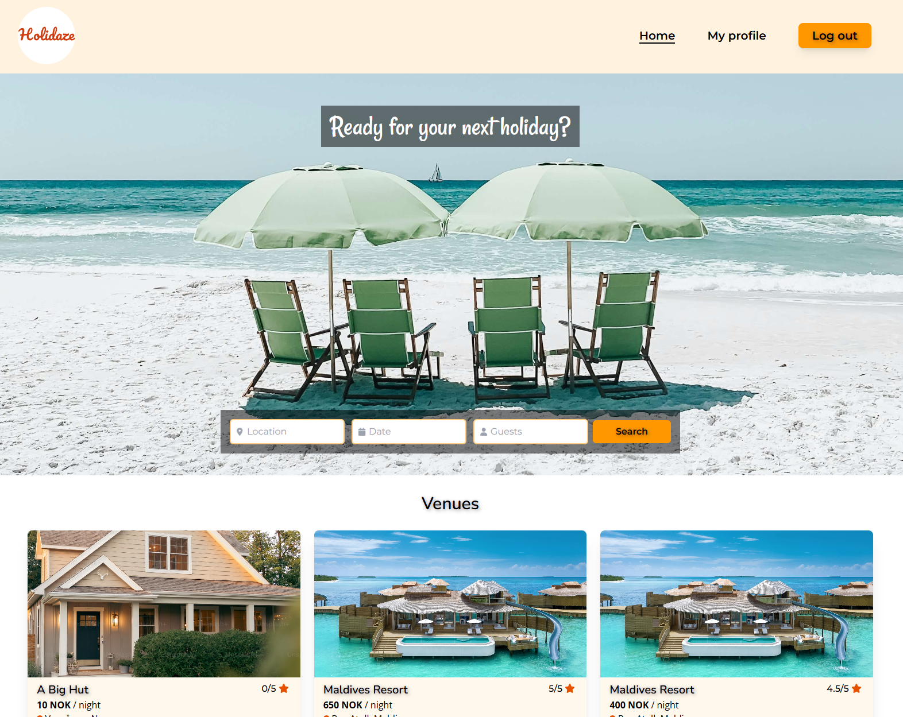

# Project Exam 2 - Holidaze



## Overview

This is my submission for the Project Exam 2 at my Front-end Development studies at Noroff. This project showcases my skills learned over the course of the last two years.
Holidaze is a web app for viewing, booking and creating holiday venues. The application communicates with an existing API to handle the venue data. There are two roles to register as; Regular customer and Venue manager. A venue manager can add, edit and delete their own venues, in addition to the other abilities the regular customers have; creating bookings at venues and editing their profile.

## Goal

Create a functional, user-friendly front-end holiday website that integrates with the Noroff API to manage venues, view bookings, and user accounts.

## Features

- All users can view a list of newest venues, and search for venues with location, dates to be booked and the number of guests.
- All users can view a specific venue by id, and see the available dates marked in a calendar.
- Registration: Users with a stud.noroff.no email address can register for the platform; either as a Customer or a Venue manager.

### For Regular Customers:

- Can create bookings at other venues made by venue managers.
- View their upcoming bookings on their profile page.
- Edit their profile by updating their avatar image and banner image.
- Login and Logout: Users can securely log in and out of their accounts.

### For Venue Managers:

- Create their own venues.
- Can update and delete a venue they manage.
- Can view upcoming bookings at a venue they manage in a table on the specific venue page.
- Edit their profile by updating their avatar image and banner image.
- View a list of both their own venues and upcoming bookings on the profile page.

## Technologies Used

- HTML5: Structure and semantics.
- React: SPA front-end library for building robust user interfaces.
- Vite: Modern tooling for fast development and optimized builds.
- Tailwind CSS: Utility-first CSS framework for styling and responsive design.
- JavaScript: Dynamic behavior and API integration.
- Noroff API: Back-end data management for venues and bookings.

## Getting Started

### Installation

1. **Clone the repo:**

```bash
git clone https://github.com/TheRegzi/holidaze.git
```

2. **Navigate to the project directory:**

```bash
cd holidaze
```

3. **Install dependencies:**

```bash
npm install
```

4. **Start the development server:**

```bash
npm run dev
```

## Deployment

The project is hosted on Netlify. Visit the application at: https://holidaze25.netlify.app

## Contact

[My LinkedIn Page](www.linkedin.com/in/regine-dille-kornbakk-aa0a7b288/)
